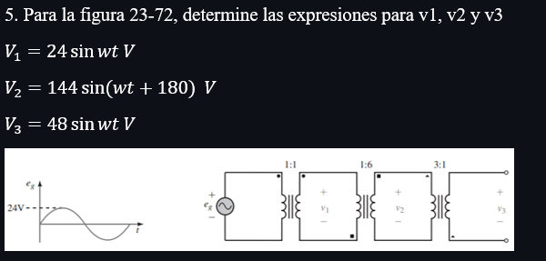
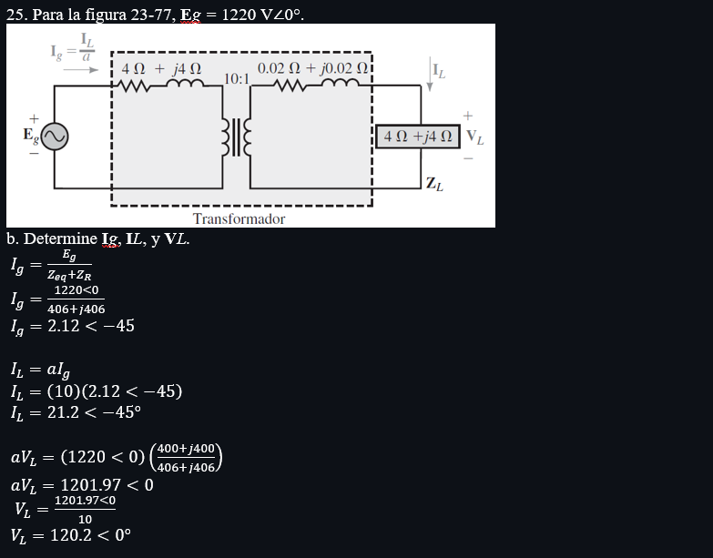
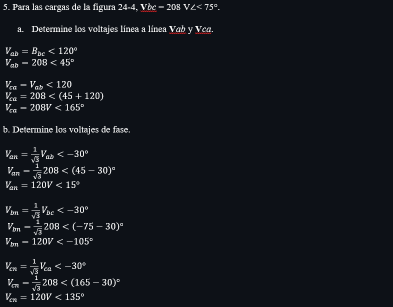

# InformeTarea9

☻ Generales:

*

☻Específicos:

* 

2. Marco Teorico 

3. EXPLICACIÓN Y RESOLUCIÓN DE EJERCICIOS O PROBLEMAS

Capitulo 23

Capitulo 24

4. VDEO:

https://youtu.be/byxpiokMCZY

6. CONCLUSIONES

*

8. BIBLIOGRAFÍA

Allan.H.Wilhelm.C.(2008). Análisis de circuitos teoría y práctica. Santa Fe, México: Cengage learning editores.
